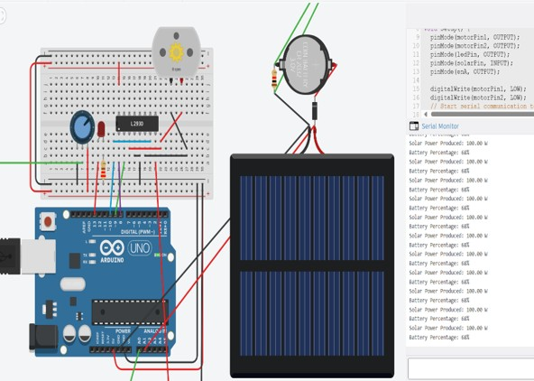
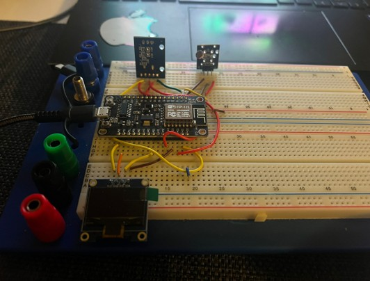
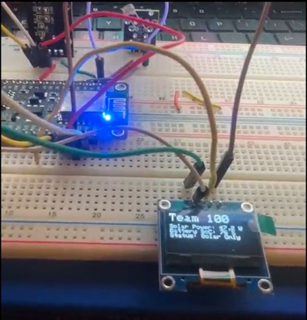
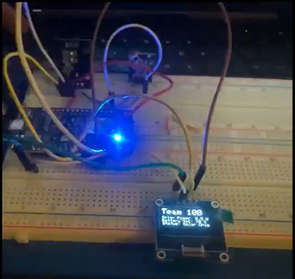
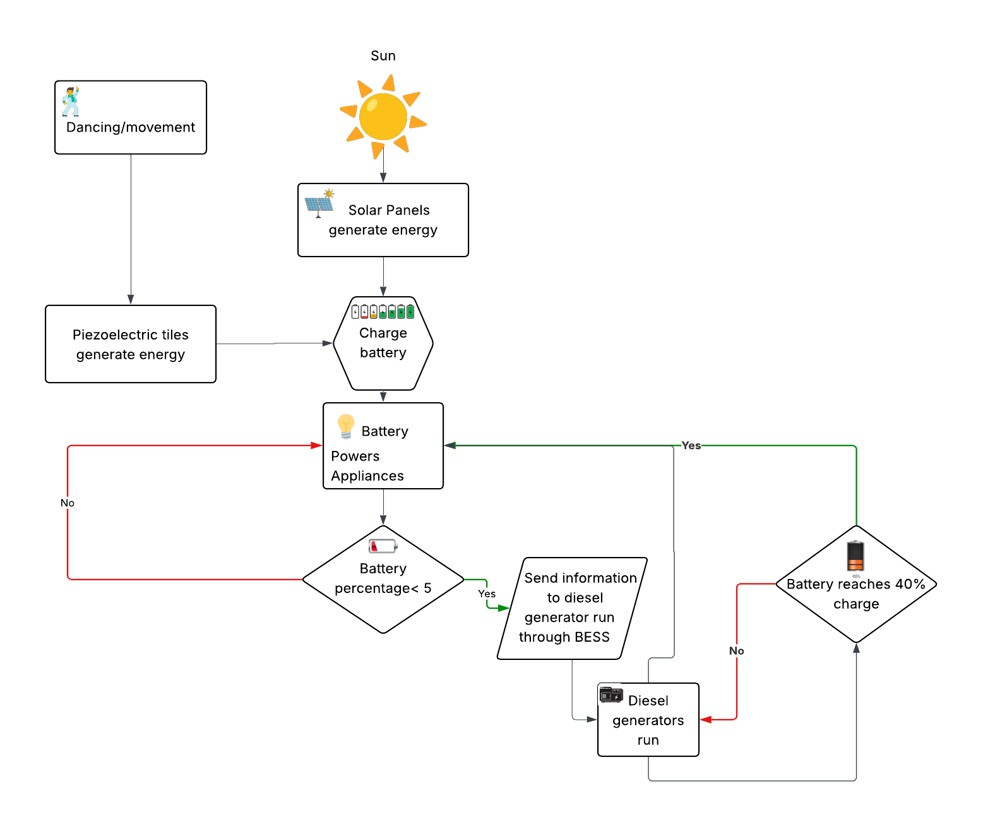
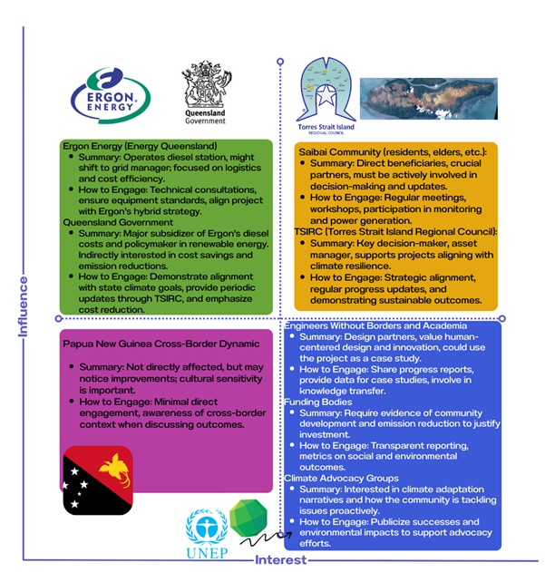
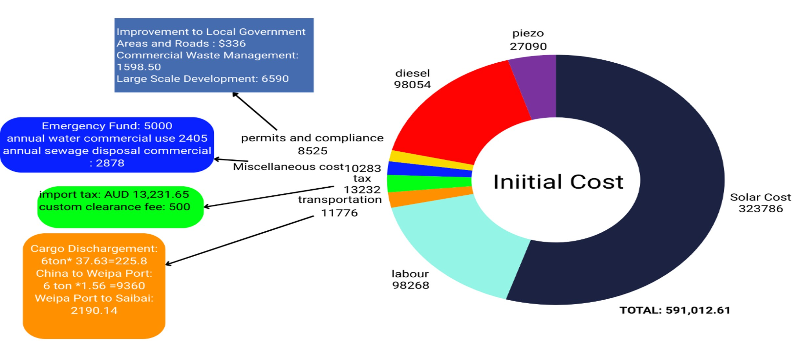
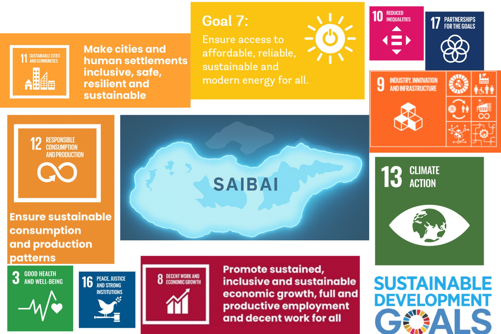

# 🌞 Hybrid Solar-Powered Energy System for Remote Communities

This project is a prototype of a **hybrid solar-powered energy system** with a **Battery Energy Storage System (BESS)** and **real-time data logging**, designed to address the energy needs of **remote communities** like **Saibai Island**. It integrates **solar**, **diesel**, and **piezoelectric** energy sources to ensure sustainability, resilience, and cultural inclusivity.

---

## 📸 Project Preview

<!-- Add your system photo or schematic diagram below -->


<!-- Add a real photo of your working prototype -->

<!-- Add a real photo of your working prototype -->

<!-- Add a real photo of your working prototype -->


---

## 🚀 Key Features

- ☀️ Solar + Diesel + Piezoelectric Hybrid Integration
- 🔋 Battery Energy Storage System (BESS)
- 📟 Real-time data logging using ESP microcontrollers
- 🌏 Designed with respect to Indigenous culture and inclusivity
- 🧮 Feasibility and stakeholder analysis included
- 🛠️ Modular and scalable for other remote communities

---

## 🛠️ System Architecture

The system includes:
- Solar PV panels as primary source
- Diesel generator as backup
- Piezoelectric modules for supplemental energy harvesting
- Battery management system (BMS) for energy storage
- ESP32/ESP8266 for real-time data logging and monitoring



---

## ⚙️ Components Used

| Component             | Purpose                           |
|----------------------|-----------------------------------|
| Solar Panel          | Primary energy generation         |
| Diesel Generator     | Backup power                      |
| Piezoelectric Modules| Energy harvesting (vibration)     |
| Lithium-Ion Battery  | Energy storage                    |
| Charge Controller    | Power regulation                  |
| ESP32 / ESP8266      | Real-time data logging            |
| Sensors (Voltage/Current/Temp) | Monitoring system health  |
| OLED Display (Optional) | Real-time local display         |

---

## 📈 Real-Time Logging and Monitoring

The ESP microcontroller sends data (e.g. voltage, current, battery status) via serial or Wi-Fi. This data can be logged to:
- SD card
- Online dashboards (e.g., Blynk, ThingSpeak, Firebase)
- Local display

```c
// Sample data logging snippet
float voltage = analogRead(V_PIN) * (5.0 / 1023.0);
Serial.print("Voltage: ");
Serial.println(voltage);
```

---

## 📍 Community Focus: Saibai Island

This project was inspired by the unique challenges faced by **Saibai Island**, a remote Torres Strait Island community. By combining engineering with cultural sensitivity, the goal is to provide a **resilient, sustainable**, and **inclusive** solution.


---

## 🧠 Learnings & Future Improvements

- 🔋 Add MPPT tracking for better solar efficiency
- 🌐 Deploy a cloud-based dashboard for remote monitoring
- 🛡️ Add surge protection and improve housing for harsh environments
- ⚡ Expand piezoelectric harvesting in dynamic environments (e.g. footpaths)

---

## 📚 Documentation

- **System Design and feasibility PDF** 
[System Design](docs/system.pdf)
- **Stakeholder Dynamics**
- **Power Budget & Load Profile**

- **Sustainability and SDGs**

---

## 🤝 Acknowledgements

We would like to acknowledge and pay our utmost respect to both the Gadigal people of the Eora Nation upon whose ancestral lands the Ultimo campus [of UTS] of which we learn from stands and the Koeybuway and Moegibuway peoples of Saibai Island on whose lands and seas our design solution is based. We acknowledge the Indigenous peoples of both Australia and the Torres Strait Islanders as the original arbiters of enduring knowledge, culture and connection to the land and sea of these places. We would also like to pay respect to the Elders past, present, and emerging, within the Indigenous community. We acknowledge that it always was and always will be and that sovereignty was never ceded. 

---

## 📬 Contact

**Adit Lohani**  
Bachelor of Electrical Engineering, UTS  
📧 contact@adit.com.np  
🌐 [adit.com.np](http://adit.com.np)


---

## 🧾 How to Use This Project

### 1. 🔽 Download the Arduino Code

This repository includes an `.ino` file (Arduino sketch) containing the code used to perform real-time data logging and system monitoring.  
You can download and open it using the **Arduino IDE**:

📁 `solar_hybrid_monitor.ino` (Add to your Arduino IDE and upload to the ESP32/ESP8266 board)

### 2. ⚙️ Required Arduino Libraries

Before uploading, make sure you have installed the following libraries in the Arduino IDE:
- `WiFi.h` or `ESP8266WiFi.h` (depending on the board)
- `Adafruit_Sensor.h`
- `Adafruit_BME280.h` (optional for environmental monitoring)
- `Wire.h` (for I2C communication)
- `SD.h` or `SPIFFS.h` (for data logging to SD card or flash)
- `U8g2lib.h` (for OLED display output, if used)

### 3. 🧩 Hardware Modules Used

| Module                          | Description                                        |
|----------------------------------|----------------------------------------------------|
| **ESP32 / ESP8266**             | Main controller for data logging and control      |
| **Solar Panel (10W or 20W)**    | Primary energy source                             |
| **Lithium-Ion Battery (3.7V)**  | Stores solar energy                               |
| **Charge Controller**           | Regulates solar input and battery output          |
| **Piezoelectric Sensor (e.g. PZT)** | Captures small vibrations to supplement power |
| **Current Sensor (ACS712/INA219)** | Measures current from solar & load paths       |
| **Voltage Divider**             | Measures system voltage safely                    |
| **BME280/DHT22 (Optional)**     | Records temperature, humidity, pressure           |
| **MicroSD Card Module**         | Stores real-time logs                             |
| **OLED Display (128x64 I2C)**   | Shows voltage, current, and battery status        |

---

## 📥 Uploading the Code

1. Connect your ESP32/ESP8266 board to your PC via USB.
2. Open the `.ino` file in the Arduino IDE.
3. Choose the correct **board** and **port** from `Tools > Board` and `Tools > Port`.
4. Click the ✅ **Verify** button to compile the code.
5. Click the ⬆️ **Upload** button to flash it to your device.
6. Open the Serial Monitor (`Ctrl + Shift + M`) to view real-time data.

---

## 📦 Folder Structure

```
/project-root
├── README.md
├── images/
│   ├── architecture_diagram.jpg
│   ├── cost.jpg
|   ├── dayoutcome.jpg
|   ├── nightoutcome.jpg
|   ├── reallife.jpg
|   ├── saibai.jpg
|   ├── sdg.jpg
|   ├── stakeholder.jpg
|   └── tinkercad.jpg
├── solar_hybrid_monitor.ino
├── tinkercad.ino
└── docs/
    ├── system.pdf
    └── presentation.pdf
```

---

